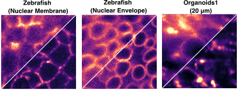

# HazeMatching

**A fast and effective posterior sampling framework for reconstructing confocal targets from widefield microscopy inputs.**

HazeMatching uses guided conditional flow matching to generate multiple plausible microscopy reconstructions instead of a single deterministic output. This enables high-quality restoration together with uncertainty estimates for downstream analysis.



## Key Features

### ✨ Key Features

* ⚡ **Fast sampling**: Orders of magnitude faster than diffusion models
* 🎯 **High-quality reconstructions**: Strong PSNR and LPIPS performance
* 🔁 **Posterior sampling**: Generate diverse outputs instead of a single estimate
* 🔬 **Calibrated uncertainty quantification**: Provides uncertainty estimates for downstream analysis

## Posterior Samples

<p align="center">
  
</p>

## Installation

```bash
pip install uv
uv sync
```

## Example Notebook

Start with [notebooks/hazematching_walkthrough.ipynb](notebooks/hazematching_walkthrough.ipynb) for a hands-on walkthrough of the full workflow: a small training demo, checkpoint inference, lightweight metrics, calibration, and visualization of widefield input / confocal target / MMSE / posterior samples.

## Datasets

HazeMatching expects paired TIFF files where:

- channel 0 is the confocal target
- channel 1 is the widefield input

Supported dataset keys:

| Subset key | Dataset |
|------------|---------|
| `zebrafish` | Zebrafish |
| `organoids1` | Organoids1 |
| `organoids2` | Organoids2 |
| `microtubule` | Microtubule |
| `neuron` | Neuron |

By default, data is expected under `data/<subset>/`. Most subsets use `train_crop/`, `val_crop/`, `test/`, and `val/`; neuron data uses `train/`, `val/`, and `test/`.

## Reproducing Results

There are two main workflows, depending on whether you want to train from scratch or use pre-trained checkpoints.

Metrics are reproducible from provided checkpoints. Full retraining may produce slight variation due to non-deterministic operations.

### Option A: Train From Scratch

1. Download data.

```bash
# Download all subsets
uv run python scripts/download_data.py

# Or download one subset
uv run python scripts/download_data.py --subset zebrafish
```

Data is saved to `data/<subset>/` by default.

2. Train a model.

```bash
uv run python scripts/train.py zebrafish
```

The best checkpoint is saved to `checkpoints/zebrafish/best_model.pth`. Training runs for 200 epochs by default.

3. Run inference.

```bash
uv run python scripts/infer.py zebrafish --checkpoint checkpoints/zebrafish/best_model.pth
```

Inference writes multi-sample TIFFs to `data/zebrafish/test_results/` and `data/zebrafish/val_results/`.

4. Compute metrics.

```bash
uv run python scripts/metrics.py zebrafish
```

The metrics script reads from `data/zebrafish/test_results/` and reports PSNR, MicroMS3IM, LPIPS, FID, FSIM, and GMSD.

5. Optionally run calibration.

```bash
uv run python scripts/calibrate.py zebrafish --results-dir data/zebrafish
```

Calibration reads `val_results/` and `test_results/` under `data/zebrafish/` and saves `data/zebrafish/calibration.pdf`.

### Option B: Use Pre-Trained Checkpoints

1. Download data.

```bash
uv run python scripts/download_data.py --subset zebrafish
```

2. Download pre-trained checkpoints.

```bash
# Download all checkpoints
uv run python scripts/download_models.py

# Or download one checkpoint
uv run python scripts/download_models.py --subset zebrafish
```

Checkpoints are saved to `checkpoints/<subset>/best_model.pth` by default.

3. Run inference.

```bash
uv run python scripts/infer.py zebrafish --checkpoint checkpoints/zebrafish/best_model.pth
```

4. Compute metrics.

```bash
uv run python scripts/metrics.py zebrafish
```

5. Optionally run calibration.

```bash
uv run python scripts/calibrate.py zebrafish --results-dir data/zebrafish
```

## Paper

*HazeMatching: Dehazing Light Microscopy Images with Guided Conditional Flow Matching*  
[https://arxiv.org/abs/2506.22397](https://arxiv.org/abs/2506.22397)

If you use this work, please cite:

```bibtex
@inproceedings{ray2026hazematching,
  title     = {HazeMatching: Dehazing Light Microscopy Images with Guided Conditional Flow Matching},
  author    = {Ray, Anirban and Ashesh, Ashesh and Jug, Florian},
  booktitle = {Proceedings of the IEEE/CVF Conference on Computer Vision and Pattern Recognition - FINDINGS Track},
  note      = {to appear},
  year      = {2026}
}
```

## Acknowledgements

We thank Francesca Casagrande, Alessandra Fasciani, Jacopo Zasso, Ilaria Laface, Dario Ricca, and Eugenia Cammarota for their valuable contributions to this work. We also acknowledge the support of [Talley Lambert](https://talleylambert.com/) at Harvard Medical School and Vera Galinova in setting up the [microsim](https://talleylambert.com/microsim/) pipeline and some baselines, as well as the entire [Jug Group](https://humantechnopole.it/en/research-groups/jug-group/) for insightful discussions.

This work was supported by the European Union through the Horizon Europe program (IMAGINE project, grant agreement 101094250-IMAGINE and AI4Life project, grant agreement 101057970-AI4LIFE) and the generous core funding of [Human Technopole](https://humantechnopole.it/en/).

## License

MIT
