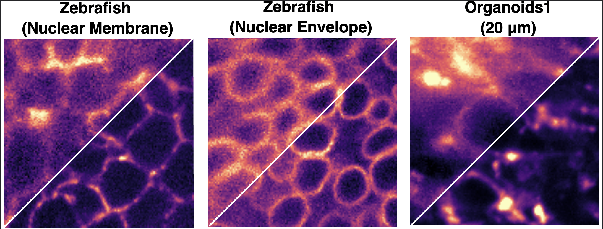

# HazeMatching

**A fast and effective posterior sampling framework for microscopy image dehazing**

---

## 🚧 Status: Code & Dataset Release Coming Soon

We are currently preparing the official release of **HazeMatching**, including:

* 🧠 Training and inference code
* 📊 Benchmark datasets (Zebrafish, Organoids, Microtubules, etc.)
* 📈 Evaluation scripts (PSNR, LPIPS, posterior sampling analysis)
* 🧪 Reproducible experiments from the paper

👉 Stay tuned — the full release will be available very soon!

---

## 🔍 Overview

HazeMatching is a **posterior sampling-based method** for microscopy image dehazing.
Unlike one-shot restoration models, it generates **multiple plausible reconstructions**, enabling better uncertainty quantification and downstream analysis.

### ✨ Key Features

* ⚡ **Fast sampling**: Orders of magnitude faster than diffusion models
* 🎯 **High-quality reconstructions**: Strong PSNR and LPIPS performance
* 🔁 **Posterior sampling**: Generate diverse outputs instead of a single estimate
* 🔬 **Calibrated uncertainty quantification**: Provides uncertainty estimates for downstream analysis

---

## 🖼️ Teaser

<p align="center">
  
</p>

### Posterior Samples

<p align="center">
  
</p>

---

## 📄 Paper

> *HazeMatching: Fast Posterior Sampling for Microscopy Image Dehazing* [https://arxiv.org/abs/2506.22397](https://arxiv.org/abs/2506.22397)

If you use this work, please consider citing:

```bibtex
@inproceedings{ray2026hazematching,
  title     = {HazeMatching: Dehazing Light Microscopy Images with Guided Conditional Flow Matching},
  author    = {Ray, Anirban and Ashesh, Ashesh and Jug, Florian},
  booktitle = {Proceedings of the IEEE/CVF Conference on Computer Vision and Pattern Recognition - FINDINGS Track},
  year      = {2026}
}
```

---

## 🙌 Acknowledgements

We thank Francesca Casagrande, Alessandra Fasciani, Jacopo Zasso, Ilaria Laface, Dario Ricca, and Eugenia Cammarota for their valuable contributions to this work. We also acknowledge the support of [Talley Lambert](https://talleylambert.com/) (Harvard Medical School) and Vera Galinova in setting up the [microsim](https://talleylambert.com/microsim/) pipeline and some baselines, as well as the entire [Jug Group](https://humantechnopole.it/en/research-groups/jug-group/) for insightful discussions. This work was supported by the European Union through the Horizon Europe program (IMAGINE project, grant agreement 101094250-IMAGINE and AI4Life project, grant agreement 101057970-AI4LIFE) and the generous core funding of [Human Technopole](https://humantechnopole.it/en/).

---

⭐ **Star this repo to stay updated!**
